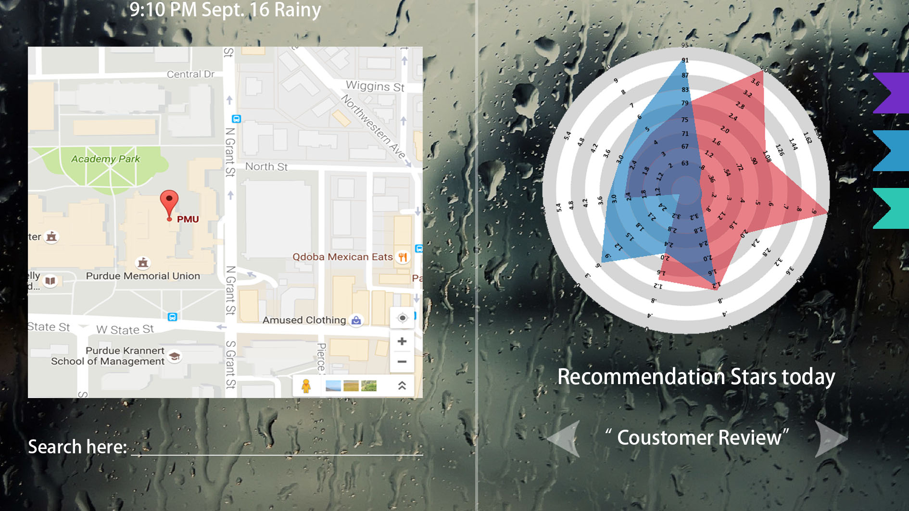

# Veg Book
*IronHack 2016 - zhe1994*

## Introduction
- Veg Book is a mash-up webapplication to help people make an appropriate decision on their choosing vegetable shops.
- Some features of the application would be:
  - Dynamic information everyday. There would be a dynamic radar chart rather than static one, for example, the price value of rainy day would be differnt with that of sunny day.
  - Bookmark. Users could mark any vegetables shop they like and the marking information would not lose whenever they visit the website if they do not clean their cookies.
  - Showing what you really considered about. Including customer's rating, car lot, traffic convenience, open hour, freshness, and so on, you could also make your own radar chart by several selecting.
  - Comparison among three shops.
  - Recommendation Stars from data analysis.
 
## Description
### DataSets used in the application
  - [Climate Data Online](http://www.ncdc.noaa.gov/cdo-web/)
     - Normals Daily Data from 2010 to 2016 in Indiana would be used
     - Columns like temperature, water, sunshince, precipitation, and etc. 
     - Very bad weather
  - [Data.gov](https://www.data.gov/)
     - Consumer's Complatint
     - Park lot

### Framework

 - See WebsiteDraft.jpg
   - left part is for Google Maps API, you can search any location you want below, besides, any vegetables shop would be star marked on the map. 
   - right part is for data visualization, customers' review, recommentation stars for shopping there today, and bookmark part. As for the radar chart, you ccould compare three shops at the same time.
   - the background would change depending on the weather
   - this is just a draft, some functions have not been added yet and future version may have many differeces with it
  
 - MapView
   - The default location would temporarily be Purdue University
   - Setting markers for location of markets
   - Having labels for markets' names
   - Having InfoWindow to show detail information of a market

 - References of some pictures used in the DraftWebsite.jpg
   - [Weather Background](http://image.baidu.com/search/detail?ct=503316480&z=0&ipn=d&word=%E9%9B%A8&step_word=&hs=0&pn=1&spn=0&di=12609462800&pi=&rn=1&tn=baiduimagedetail&is=&istype=0&ie=utf-8&oe=utf-8&in=&cl=2&lm=-1&st=undefined&cs=116146246%2C280923171&os=4049081853%2C397660215&simid=0%2C0&adpicid=0&ln=1991&fr=&fmq=1474073596867_R&fm=&ic=undefined&s=undefined&se=&sme=&tab=0&width=&height=&face=undefined&ist=&jit=&cg=&bdtype=10&oriquery=&objurl=http%3A%2F%2Fatth.jzb.com%2Fforum%2F201404%2F05%2F092434vxc2nww5l6z9ozcv.jpg&fromurl=ippr_z2C%24qAzdH3FAzdH3F3zk_z%26e3Bv54AzdH3FkkfAzdH3Fpi6jw1-d0nnm9c-8-8_z%26e3Bip4s&gsm=0&rpstart=0&rpnum=0)
   - [Radar Chart](https://www.google.com/search?q=google+map&newwindow=1&biw=1536&bih=734&tbm=isch&source=lnms&sa=X&ved=0ahUKEwiHr5mRmZXPAhUm6oMKHaZkCicQ_AUICSgE#newwindow=1&tbm=isch&q=radar+chart&imgrc=JVCir07tDKjEuM%3A)

### DataVisualization
  - Radar or other chart to represent information associated with attributions of the veggies, weather, transportation, and etc.
  - Using D3 Library to implement data visualization
  - You could select variables you conerned most to generate the final radar chart
 
### Interaction Form
  - Output information
     - Values of every attribution user selected
     - Recommendation Stars for shopping today
     - Customers' reviews
  - Operation Option
     - Filter based on price
     - Sort base on convenience
  - Interaction with Map
     - Some simple interactions provided by Google Maps' API

### Content
  - index.html (*mash-up Webpage*)
  - styles.css (*using Bootstrap framework*)
  - js folder (*putting in all .js files used in the appliction*)
  - lib folder (*putting in all libraries used in the application*)
  - images folder (*containing all image files of the website*)
  - README.md (*introduction, compiling information, and additional information*)

### Build Case
 - This application would be cross-platform, for now nothing would be used besides HTML/CSS/Javascript

### Test Case
  - The final version of the web application would be tested on Chrome, Firefox, Safari, and IE, exact version of browsers would be listed here at the end of the project

### Key Words
  - *Vegetables; Freshness; Weather;*